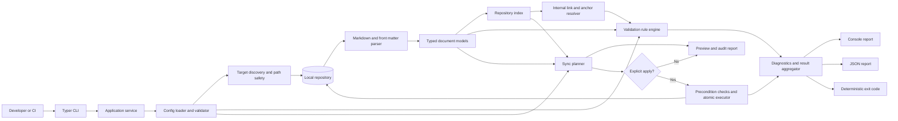

# Automated Documentation Sync Engine Architecture

## 1. Architectural goals

The engine is a Python 3.11+ command-line tool and reusable library for validating and synchronizing Markdown documentation in a local repository. The architecture prioritizes:

- Read-only validation by default and explicit opt-in for synchronization.
- Deterministic findings, ordering, reports, and exit codes.
- Clear separation between parsing, validation, planning, and file mutation.
- Repository-boundary and path safety for all configured inputs.
- Typed programmatic APIs and a stable machine-readable diagnostic schema.
- Operation without network access for core validation.

The design is intentionally a modular monolith. The components share one process and package, which keeps installation and CI use simple while preserving boundaries that can be tested and evolved independently.

## 2. Recommended technology choices

| Concern | Recommendation | Rationale |
| --- | --- | --- |
| Runtime | Python 3.11+ | Required platform; provides modern typing and standard-library filesystem support. |
| CLI | Typer with Click underneath | Typed command definitions, good help output, and straightforward library-to-CLI wiring. |
| Configuration | `tomllib` for TOML loading, with Pydantic models for validation | TOML is available in the standard library, is predictable, and maps well to typed configuration. Pydantic provides useful type and constraint errors. |
| Markdown parsing | `markdown-it-py` with a configured CommonMark preset | Produces a token stream that can distinguish headings, links, and fenced code blocks without executing or rendering content. |
| Front matter | `python-frontmatter` or a small YAML/TOML front-matter adapter | Isolates metadata parsing from Markdown parsing. The selected adapter must treat metadata as data and reject malformed input clearly. |
| Data models | Pydantic v2 models or frozen dataclasses at internal boundaries | Provides typed public results and serializable diagnostics. Frozen models help prevent accidental mutation during validation. |
| Path handling | `pathlib` plus `os.path.realpath` boundary checks | Cross-platform repository-relative paths and explicit protection against traversal and symlink escapes. |
| Reports | Standard-library `json` plus a deterministic console formatter | Avoids an unnecessary runtime dependency and supports a documented stable JSON schema. |
| File writes | Temporary file in the destination directory followed by atomic `os.replace` | Prevents partially written synchronized files where the operating system supports atomic replacement. |
| Testing | pytest, pytest-cov, and temporary repository fixtures | Covers parser edge cases, rule behavior, synchronization safety, schemas, and exit codes. |
| Quality | Ruff for linting/formatting and mypy or Pyright for static typing | Fast, automatable checks for the Python package and public API. |
| Packaging | `pyproject.toml` with a `src/` package layout and a console-script entry point | Supports installation as both a library and executable, with dependency constraints managed in one place. |

The exact front-matter dependency should follow the repository's configuration decision. It must support the formats documented by the tool and must not evaluate arbitrary tags or code.

## 3. Component responsibilities

### CLI and application service

The CLI is a thin adapter over application services. It parses commands and options such as `check`, `config validate`, `sync preview`, and `sync apply`, then maps typed results to console output and documented process exit codes. It does not contain parsing or rule logic.

The application service coordinates one operation from configuration loading through reporting. It owns the execution mode, cancellation/error boundaries, deterministic sorting, and the rule that synchronization is never entered unless explicitly requested.

### Configuration

The configuration component:

- Loads the repository-level TOML file.
- Validates schema, types, unknown keys, paths, exclusions, severity policy, report options, and synchronization rules.
- Resolves configuration paths relative to the repository root.
- Produces a configuration identity, such as a stable hash of normalized configuration, for reports.

Configuration errors stop execution before target files are changed.

### Repository and target discovery

The discovery component accepts files, directories, glob patterns, and configured defaults. It normalizes paths, applies exclusions, deduplicates targets, verifies repository boundaries, and returns a sorted list of Markdown targets. Missing, unreadable, duplicated, or unsupported inputs become structured diagnostics rather than uncaught ad hoc errors.

### Markdown parser and document model

The parser reads each target without executing embedded content and produces an immutable document model containing:

- Repository-relative path and source metadata.
- Headings with normalized text, level, and source location.
- Links with original destination, resolved path candidate, anchor, and source location.
- Fenced-code ranges so syntax inside code blocks is ignored.
- Optional front matter and its source span.
- Enough original text and line-ending information for safe synchronization.

The parser should expose source locations while keeping raw file content local to the processing context. Reports include paths and snippets only when needed, avoiding accidental disclosure of sensitive content.

### Validation rules

Validators consume the document model, configuration, and repository index. They do not write files. Rules should be small and independently testable:

- Required sections, duplicate sections, and heading hierarchy.
- Front matter presence, values, and basic types.
- Internal file links, repository boundaries, and normalized heading anchors.
- Configured source-to-target drift checks.

Each rule emits a typed diagnostic with a stable rule identifier, severity, message, repository-relative path, optional line and column, and remediation details. Validators run independently where possible, then diagnostics are sorted by path, location, rule identifier, and message for reproducibility.

### Repository index and link resolver

The repository index maps normalized repository-relative paths to parsed documents and heading anchors. The link resolver uses this index to validate internal file links and anchors without network access. External URLs and configured exclusions are classified rather than fetched. Path normalization and boundary checks happen before lookup.

### Synchronization planner and executor

Synchronization is split into two components:

1. **Planner:** evaluates explicit synchronization rules, compares the source of truth with the configured target region, detects stale or ambiguous inputs, and creates an immutable synchronization plan. A plan includes expected source/target fingerprints, affected region, proposed replacement, conflict status, and audit details.
2. **Executor:** accepts only an approved plan, rechecks the expected fingerprints, applies changes to configured regions, preserves content outside those regions, and writes each file atomically. Files are processed in deterministic order. Any conflict or failed precondition stops the operation before that file is replaced.

Preview uses the planner and report formatter but never invokes the executor. Apply requires an explicit command and should report every changed, skipped, and failed rule.

### Reporting and result contracts

The result layer aggregates scope, tool version, configuration identity, scanned files, changed files, diagnostics, severity counts, duration, and overall status. One typed result can be rendered as human-readable console output or the stable JSON schema. Report destinations are selected independently from the operation and output failures are represented as execution errors.

## 4. Data flow

1. The CLI receives a command, target arguments, mode, and report options.
2. The application service identifies the repository root and loads/validates TOML configuration.
3. Discovery resolves targets and exclusions into a deterministic Markdown file list.
4. The parser reads files and creates document models with source locations.
5. The repository index records paths and heading anchors for link resolution.
6. Structural, metadata, link, and configured drift validators consume the models and emit diagnostics.
7. In check mode, the result aggregator renders reports and computes the configured exit status.
8. In preview mode, the synchronization planner produces proposed changes and renders an audit report without writing.
9. In apply mode, the executor rechecks plan preconditions, atomically writes approved changes, and returns changed-file audit records.
10. The result aggregator renders the final console and/or JSON report and maps the result to a documented exit code.

Validation of independent documents may be parallelized later, but collection and final sorting must remain deterministic. Synchronization writes must remain ordered and must not be performed concurrently unless the executor can prove there are no overlapping targets.

## 5. High-level system diagram



## 6. Package mapping

The existing repository structure maps naturally to the architecture:

```text
src/
	cli.py                 # command definitions and exit-code mapping
	config.py              # TOML loading and typed configuration
	models.py              # document, diagnostic, plan, and result models
	parsers/
		markdown.py          # Markdown tokenization and document model creation
		frontmatter.py       # front matter extraction and validation
	sync/
		planner.py           # drift detection and immutable sync plans
		executor.py          # conflict checks and atomic writes
	validators/
		structural.py        # headings, required sections, metadata
		links.py              # file and anchor validation
	utils/
		paths.py             # root containment and normalized paths
		reporting.py         # console and JSON rendering
		discovery.py         # target expansion and exclusions
tests/
```

If the project chooses a different module layout, the ownership boundaries should remain the same: parser code must not write files, validators must not mutate state, and only the synchronization executor may commit content changes.

## 7. Safety and operational decisions

- **Check-only default:** the normal validation path has no write capability in its call graph.
- **Explicit synchronization:** `sync apply` is the only operation allowed to replace files; preview and check are read-only.
- **Conflict protection:** plans carry source and target fingerprints and are revalidated immediately before writing.
- **Atomicity:** write a temporary file beside the target, flush it, and replace the target atomically. Clean up temporary files on failure.
- **Path containment:** compare resolved paths against the resolved repository root, including symlink resolution where applicable.
- **Untrusted content:** never execute Markdown, front matter, templates, or code blocks; never make external network calls during core validation.
- **Stable output:** sort paths and findings, use explicit timestamp/version fields, and version the JSON report schema.
- **Resource limits:** stream or process files one at a time where practical, define a maximum supported file size, and avoid retaining all raw file contents in memory.

## 8. Testing and evolution strategy

Unit tests should cover each parser and rule independently. Integration fixtures should exercise a temporary repository containing valid documents, broken links, code fences, malformed front matter, duplicate headings, path traversal attempts, and conflicting synchronization inputs. Contract tests should lock down JSON field names, rule identifiers, and exit codes.

The public API, configuration keys, diagnostic identifiers, report schema, and exit codes should be versioned. New rules should be additive where possible, with severity controlled through configuration so teams can adopt them without unexpected synchronization or CI failures.
